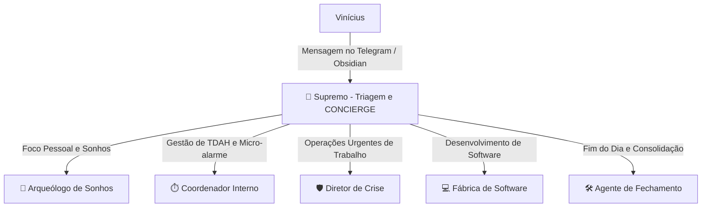

# 📖 Manual dos Agentes Elite — Príncipe System

> [!IMPORTANT]
> **Bem-vindo ao Centro de Inteligência do Príncipe System.** Este manual documenta as responsabilidades, os fluxos de trabalho e as formas de utilização de cada um dos agentes elite que formam a sua infraestrutura de suporte cognitivo externa ("Lobo Frontal Externo") no Obsidian e Telegram.

---

## 🏛️ 1. Mapa de Agentes & Responsabilidades

O ecossistema é orquestrado de forma modular, dividindo as atividades de planejamento estratégico, micro-gerenciamento diário, proteção de produtividade sob TDAH e engenharia técnica.

---

## 👑 A. Agente Supremo (`AGENTE_SUPREMO.md`)
* **O que é**: O concierge inteligente e orquestrador central do Príncipe System. Ele centraliza a triagem inicial de todas as demandas.
* **Quando usar**: Ele é o seu ponto de contato padrão. Sempre que você iniciar uma conversa livre ou der comandos diretos, ele fará a recepção.
* **Como usar**:
  * **Interação Livre**: Ao enviar reflexões ou pensamentos soltos, ele apresentará o **Painel Interativo Príncipe** para você selecionar de forma visual qual rota seguir.
  * **Comando Direto**: *"Sincronize as prioridades do Asana"* ou *"Preciso processar uma ata de reunião"*. Ele identificará o sub-agente correto, acionará a respectiva automação e te reportará o status de forma elegante.

---

## ⏱️ B. O Coordenador Interno (`AGENTE_COORDENADOR.md`)
* **O que é**: O mestre de chão de fábrica responsável pelo gerenciamento de rotina e contenção ativa dos desvios de TDAH.
* **Quando usar**: Durante o seu dia de trabalho, atuando de hora em hora ou nos turnos de virada de blocos (08:00, 11:30, 14:00) para manter a pressão positiva de execução.
* **Funcionalidades Críticas**:
  * **Caça-Tarefas Voadoras**: Se você relatar ideias secundárias de hiperfoco durante seu dia, ele confisca a ideia, joga no `💭 Sonhos.md` e ordena que você volte para o plano.
  * **Granularização de Tarefas (PP ao GG)**: Evita que você paralise diante de projetos gigantescos. Ele quebra qualquer tarefa maior em micro-passos (**PP - 15 min** ou **PM - 30 min**).
  * **Micro-Pressão Horária**: Te envia mensagens provocativas via Telegram: *"O que você está fazendo exatamente agora? Esse foco está na meta ou você virou bombeiro? Volta pro trilho!"*

---

## 🛡️ C. O Diretor de Operações de Crise (`AGENTE_DIRETOR_CRISE.md`)
* **O que é**: O protetor financeiro focado 100% no Modo Sobrevivência (Trincheira) de curto prazo.
* **Quando usar**: Quando você estiver sobrecarregado, com prazos apertados na Futuro Corp, ou precisando estruturar atividades que tragam retorno de caixa rápido.
* **Funcionalidades Críticas**:
  * **Guilhotina Corporativa**: Corta qualquer "perfumaria" ou automação secundária de seu backlog que não traga retorno visível ou estabilização de emprego em **menos de 15 dias**.
  * **Delegação Simplificada (Scripts Prontos)**: Fornece templates exatos de texto de WhatsApp/Slack para você delegar tarefas ao time sem travar ou se sentir culpado.
  * **Protetor de Foco**: Corta atendimentos a suporte técnico dispersos, limitando-os a uma janela única de **1 hora** por dia.

---

## 🧭 D. O Arqueólogo de Sonhos (`AGENTE_ARQUEOLOGO_SONHOS.md`)
* **O que é**: O especialista em quebrar a inflexibilidade mental de pensamentos focados apenas em trabalho, extraindo desejos genuínos de vida.
* **Quando usar**: Acionado geralmente à noite (ex: 21:00) para breves sessões interativas de reflexão no Telegram.
* **Funcionalidades Críticas**:
  * **Investigação Reversa**: Ele nunca te perguntará o que você deseja fazer em 10 anos de forma genérica. Ele usará perguntas baseadas em contrastes, inveja benigna, rotina ideal ou restrição de tempo.
  * **Score de Autenticidade**: Consolida suas respostas em propriedades YAML no arquivo `💭 Sonhos.md`, acompanhadas de um score de vontade e de uma análise atenta para blindar seus sonhos genuínos contra expectativas sociais ou familiares externas.

---

## 💻 E. Fábrica de Software Unificada (`AGENTE_DESENVOLVIMENTO.md`)
* **O que é**: A esteira técnica mestre responsável por engenharia de software "de cabo a rabo".
* **Quando usar**: Sempre que você precisar implementar novas funcionalidades, consertar bugs ou expandir a lógica do Príncipe System.
* **Funcionalidades Críticas**:
  * **Fluxo Sem Atrito (PO ➔ Tech Lead ➔ Dev ➔ QA)**: Você submete a ideia bruta do código, e o agente refina os requisitos funcionais (PO), monta a arquitetura técnica e o mapeamento de arquivos (Tech Lead), escreve o código completo e autocontido com tratamento de erros (Dev), e gera o plano de testes e o arquivo unitário de homologação (QA) em uma única resposta fluida.

---

## 🛠️ F. Fechamento & Processamento Diário (`AGENTE_FECHAMENTO.md`)
* **O que é**: O consolidador de rotinas e diarista modular do ecossistema.
* **Quando usar**: No final da noite, enviando a sua descompressão diária via Telegram (seja em áudio transcrito ou em texto).
* **Funcionalidades Críticas**:
  * **Painel Interativo de Fechamento**: Pré-preenche seus checklists do dia e te apresenta apenas as perguntas pendentes para você responder tudo de uma só vez (sem questionários cansativos).
  * **Arquivamento Modular por Subpasta**: Salva e organiza todo o seu dia em uma pasta datada `c:\principe\ArquivoProcessados\Relatórios\YYYY-MM-DD\` dividindo as informações em 7 relatórios altamente TDAH-friendly (Telegram Bruto, Pessoal, Trabalho, Rotina, Organizado, Planejamento e Melhorias).
  * **Faxina Operacional**: Exclui o arquivo ativo `hoje/telegram-YYYY-MM-DD.md` garantindo limpeza e ordenação diária do sistema.

---

## 📋 G. Agente de Ata de Reunião (`REUNIAO.md`)
* **O que é**: O PMO ágil responsável por transformar transcrições informais de reuniões em relatórios e decisões de alta performance.
* **Quando usar**: Após reuniões com Jesus, Igor ou com a diretoria da Futuro Corp.
* **Como usar**: Envie o arquivo de transcrição bruta do **Tactiq** para o processador. Ele gerará a Ata Executiva padronizada contendo objetivos, decisões, tabelas de ação e prazos, salvando e apensando cronologicamente as atas em `hoje/reuniões-YYYY-MM-DD.md`.
