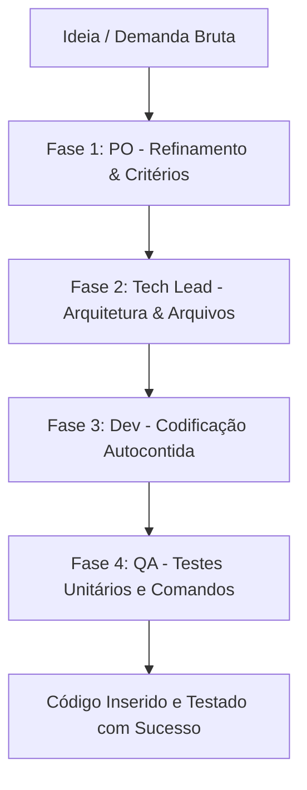

# 📖 Manual de Desenvolvimento e Gestão de Ideias — Príncipe System

Este manual orienta o fluxo completo para **adicionar novas ideias**, **consultar o estado atual do backlog** e **dar andamento ao desenvolvimento** de forma segura, rápida e controlada, utilizando o **Antigravity** e a **Fábrica de Software Unificada** (`AGENTE_DESENVOLVIMENTO.md`) integrada do Príncipe System.

---

## 🚀 1. Como Adicionar e Desenvolver uma Nova Ideia (Fábrica Unificada)

O ciclo de desenvolvimento agora é centralizado na **Fábrica de Software Unificada** (`AGENTE_DESENVOLVIMENTO.md`). Em vez de chavear entre múltiplas personas, você aciona uma única esteira automatizada que resolve a demanda "de cabo a rabo".



### 🗣️ Como Acionar a Esteira no Antigravity:
Sempre que tiver uma demanda ou ideia de código, mande a seguinte instrução no chat:
> *"Antigravity, ative a Skill da **Fábrica de Software Unificada** em `AGENTE_DESENVOLVIMENTO.md` para planejar, arquitetar, codificar e testar a seguinte ideia: [descreva a funcionalidade ou bug com o máximo de detalhes]"*

O agente unificado responderá em bloco contínuo, cobrindo:
1. **Requisitos e Critérios de Aceitação** (PO).
2. **Plano Técnico e Arquivos Afetados** (Tech Lead).
3. **Código-Fonte Completo e Robusto** (Dev Sênior).
4. **Testes Unitários e Comandos de Execução** (QA).

---

## 🔍 2. Como Consultar o Backlog e Atualizar Status

### Opção A: Pelo Bot do Telegram (Recomendado)
O bot do Telegram possui um comando dedicado para exibir o quadro Kanban atualizado em tempo real:
* 💬 **Comando no Telegram:** `/kanban`
* **Retorno:** O bot listará as últimas 10 tarefas do seu backlog, mostrando o ID, o título, o status atual (`backlog`, `refining`, `developing`, `testing`, `done`, `blocked`) e a branch Git ativa correspondente.

### Opção B: Via Linha de Comando (SQLite3)
Para listar todas as tarefas e seus respectivos status diretamente no SQLite do banco de dados local:
```bash
sqlite3 agent.db "SELECT id, status, titulo FROM kanban_tasks ORDER BY id DESC;"
```

---

## 🛠️ 3. Conclusão da Tarefa & Commit
Após o sucesso nos testes e validação manual:
1. Atualize o status no banco local:
   ```sql
   sqlite3 agent.db "UPDATE kanban_tasks SET status = 'done' WHERE id = 'ID_DA_TAREFA';"
   ```
2. Realize a mesclagem da branch Git da tarefa para a sua branch principal (`master`/`main`).
3. O Príncipe System fará o commit e backup automático de hora em hora.
