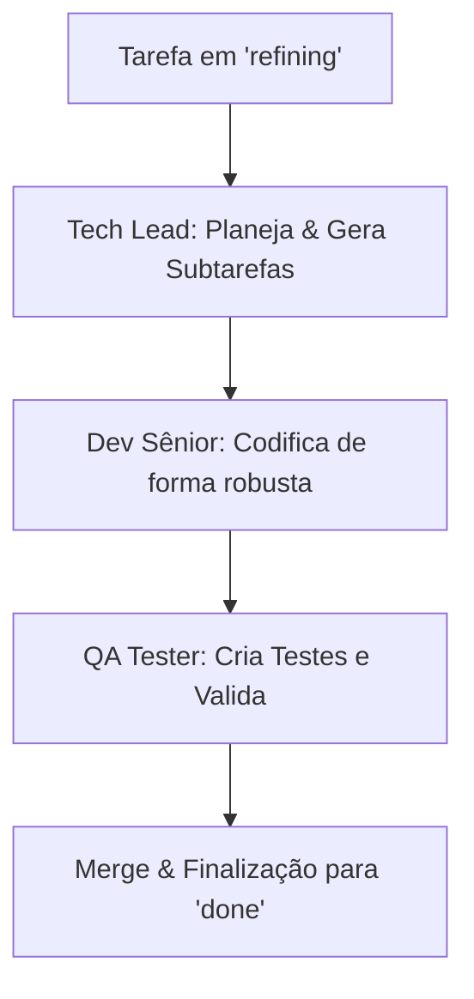

# 📖 Manual de Desenvolvimento e Gestão de Ideias — Hórus System

Este manual orienta o fluxo completo para **adicionar novas ideias**, **consultar o estado atual do backlog** e **dar andamento ao desenvolvimento** de forma segura e controlada, utilizando o **Antigravity** e as Skills integradas do Hórus System.

---

## 🚀 1. Como Adicionar uma Nova Ideia

O gerenciamento de ideias é realizado em parceria direta com a persona **Product Owner (PO)** no chat do Antigravity.

### Passo A: Refinamento da Ideia no Antigravity
Sempre que tiver uma ideia bruta ou necessidade de melhoria, envie a seguinte instrução no chat do Antigravity:

> 🗣️ **Comando para o Chat:**
> *"Antigravity, ative a Skill do **Product Owner** (PO) em `skills/1_product_owner.md` para refinar a seguinte ideia: [descreva a sua ideia com o máximo de detalhes possível]"*

O PO irá responder com:
1. Uma **Ficha de Refinamento** contendo o escopo detalhado.
2. A classificação na **Curva ABC** (A: Crítico, B: Médio prazo, C: Melhoria).
3. **Critérios de Aceitação** claros.
4. Um **Script SQL personalizado** para registrar a tarefa no banco de dados local.

---

### Passo B: Inserir a Nova Ideia no Kanban Local
Para inserir a tarefa refinada no banco de dados SQLite (`agent.db`), você tem duas opções simples:

#### Opção 1: Via Linha de Comando (SQLite3)
No terminal do seu IDE ou do sistema, execute o comando abaixo para se conectar ao banco e rodar o SQL:
```bash
sqlite3 agent.db
```
Depois, execute o comando SQL fornecido pelo PO (substituindo pelos dados gerados):
```sql
INSERT INTO kanban_tasks (id, titulo, status, branch_name, descricao_original) 
VALUES ('task_AAAAMMDD_HHMMSS', 'Nome da Tarefa', 'refining', 'task-nome-da-tarefa', 'Descrição bruta da ideia');
```

#### Opção 2: Via Script Python Rápido
Se preferir não digitar SQL manualmente, você pode criar um script rápido ou usar o console interativo do Python na raiz do projeto:
```python
import sqlite3
import datetime

conn = sqlite3.connect("agent.db")
cursor = conn.cursor()

task_id = f"task_{datetime.datetime.now().strftime('%Y%m%d_%H%M%S')}"
cursor.execute("""
    INSERT INTO kanban_tasks (id, titulo, status, branch_name, descricao_original)
    VALUES (?, ?, ?, ?, ?)
""", (task_id, "Título da Nova Ideia", "refining", f"task-{task_id}", "Descrição original aqui"))

conn.commit()
conn.close()
print(f"Tarefa criada com ID: {task_id}")
```

---

## 🔍 2. Como Consultar as Ideias Cadastradas

Você pode acompanhar e consultar o andamento de suas ideias tanto pela interface do chat quanto diretamente no banco de dados.

### Opção A: Pelo Bot do Telegram (Recomendado)
O bot do Hórus possui um comando dedicado para exibir o quadro Kanban atualizado em tempo real:
*   💬 **Comando no Telegram:** `/kanban`
*   **Retorno:** O bot listará as últimas 10 tarefas do seu backlog, mostrando o ID, o título, o status atual (`backlog`, `refining`, `developing`, `testing`, `done`, `blocked`) e a branch Git ativa correspondente.

### Opção B: Consulta direta no Banco de Dados
Para listar todas as tarefas e seus respectivos status diretamente no SQLite:
```bash
sqlite3 agent.db "SELECT id, status, titulo FROM kanban_tasks ORDER BY id DESC;"
```

---

## ⚙️ 3. Como Dar Andamento e Desenvolver a Ideia

Uma vez que a tarefa está no banco com o status inicial `refining`, o ciclo de desenvolvimento segue as diretrizes da **Orquestração de Sprint** (`skills/sprint_orchestrator.md`).



### Passo 1: Planejamento Técnico (Tech Lead)
*   **O que fazer:** Ative a persona de liderança arquitetural para mapear os arquivos afetados e avaliar os riscos.
*   💬 **Comando no Antigravity:**
    > *"Antigravity, ative a Skill do **Tech Lead** em `skills/2_tech_lead.md` para criar o plano técnico e arquitetural da tarefa [ID_DA_TAREFA]."*
*   **Ação no Banco:** O status da tarefa passará para `developing` e as subtarefas técnicas serão geradas.

### Passo 2: Codificação de Elite (Dev Sênior)
*   **O que fazer:** Implementar o código limpo, sem placeholders e com tratamento completo de erros.
*   💬 **Comando no Antigravity:**
    > *"Antigravity, ative a Skill de **Dev Sênior** em `skills/3_developer.md` para codificar as modificações planejadas para a tarefa [ID_DA_TAREFA]."*

### Passo 3: Criação de Testes e Validação (QA)
*   **O que fazer:** Validar a funcionalidade com cenários de teste automatizados locais.
*   💬 **Comando no Antigravity:**
    > *"Antigravity, ative a Skill de **QA** em `skills/4_qa_tester.md` para criar e rodar os testes unitários da tarefa [ID_DA_TAREFA]."*

### Passo 4: Atualização de Status e Conclusão
*   Após o sucesso nos testes e validação manual, atualize o status da tarefa para concluído no banco de dados:
```sql
UPDATE kanban_tasks SET status = 'done' WHERE id = 'ID_DA_TAREFA';
```
*   Mescle a branch Git da tarefa para a sua branch principal (`master`/`main`).
