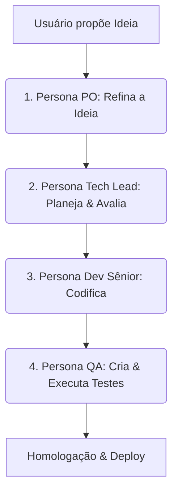

# 🚀 Guia de Orquestração de Sprint com o Antigravity

Bem-vindo ao novo modelo de desenvolvimento do **Hórus System**! Em vez de deixar agentes automáticos e instáveis tomando decisões sozinhos no servidor, agora nós dois formamos o time completo de desenvolvimento de elite diretamente aqui no **Antigravity**.

Este guia explica como nós vamos atuar juntos para planejar, codificar, testar e entregar novas funcionalidades utilizando as Skills que criei na pasta `skills/`.

---

## 🔄 O Fluxo de Desenvolvimento Local (Passo a Passo)

### 1. Refinamento (Product Owner)
- **Quando usar**: Sempre que você tiver uma ideia de recurso ou melhoria.
- **Como chamar no chat**: 
  > *"Antigravity, ative a Skill do **Product Owner** (PO) em `skills/1_product_owner.md` para refinar a seguinte ideia: [descreva a ideia aqui]"*
- **O que eu vou entregar**: A Ficha de Refinamento com requisitos funcionais, critérios de aceitação e a classificação na Curva ABC (`A`, `B` ou `C`), além de um script SQL para colocar o card no seu Kanban local se você desejar.

### 2. Planejamento (Tech Lead)
- **Quando usar**: Logo após aprovar o refinamento e requisitos do PO.
- **Como chamar no chat**:
  > *"Antigravity, ative a Skill do **Tech Lead** em `skills/2_tech_lead.md` para criar o plano técnico e arquitetural da tarefa que acabamos de refinar."*
- **O que eu vou entregar**: O mapeamento exato dos arquivos que serão modificados/criados, avaliação de impacto/risco e as subtarefas técnicas sequenciais.

### 3. Codificação (Dev Sênior)
- **Quando usar**: Com o plano do Tech Lead aprovado por você.
- **Como chamar no chat**:
  > *"Antigravity, ative a Skill de **Dev Sênior** em `skills/3_developer.md` para codificar as modificações do plano técnico."*
- **O que eu vou entregar**: O código de produção limpo, sem placeholders, robusto e totalmente pronto para os arquivos afetados.

### 4. Validação (QA)
- **Quando usar**: Com os códigos criados pelo Dev, antes de finalizar o card.
- **Como chamar no chat**:
  > *"Antigravity, ative a Skill de **QA** em `skills/4_qa_tester.md` para criar os testes unitários da nossa alteração."*
- **O que eu vou entregar**: Um script de teste automatizado (`unittest` ou `pytest`) e o comando exato para você rodar na sua máquina local ou WSL para certificar que tudo funciona.

---

> [!NOTE]
> **Vantagens deste modelo:**
> - **Total controle**: Você decide exatamente o que entra no seu projeto, sem código gerado de forma invisível.
> - **Qualidade de código superior**: Como par de programação ativo, eu consigo aplicar revisões profundas e seguir os padrões de design mais premium.
> - **Menos bugs e retrabalho**: O fluxo estruturado impede que pulemos etapas vitais como arquitetura e testes.
