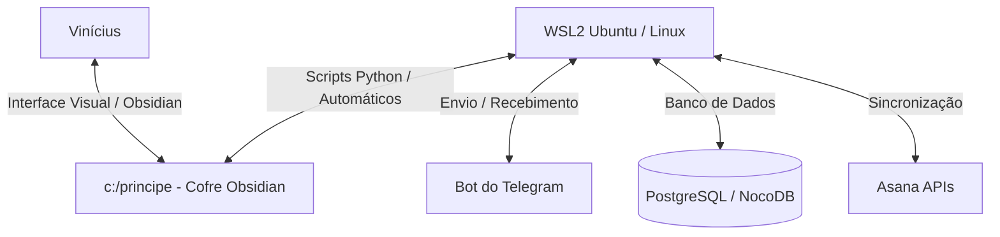
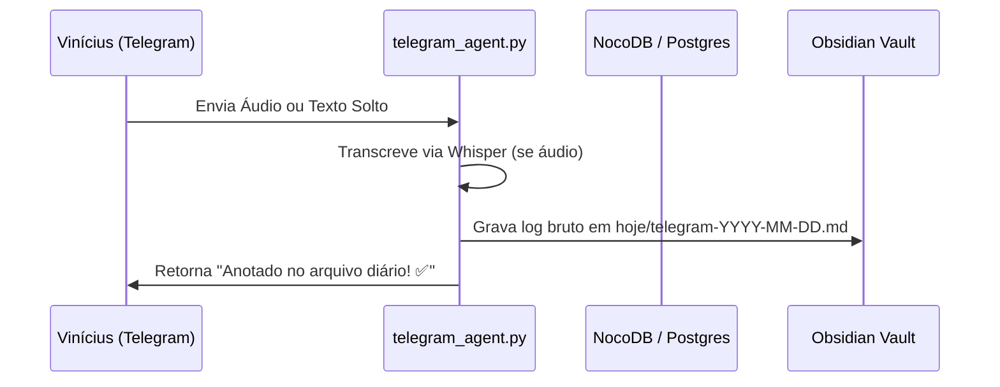

# 🌐 1. O que é o Sistema & Como Ele Funciona

O **Príncipe System (Hórus)** é um ecossistema cognitivo híbrido projetado especificamente para atuar como o seu **Lobo Frontal Externo**. Ele foi construído para blindar a sua atenção, combater a procrastinação e a inflexibilidade de pensamentos decorrentes do TDAH, organizando sua vida pessoal e profissional de forma científica e de baixíssimo atrito.

---

## 🏛️ A Filosofia do Lobo Frontal Externo

Pessoas neurodivergentes costumam sofrer com a sobrecarga de memória de trabalho e a dificuldade em iniciar ou priorizar tarefas. O sistema resolve isso tirando toda a carga de organização da sua cabeça:
* **Entrada Rápida (Sem Atrito)**: Você fala um áudio rápido no Telegram deitado no sofá ou na rua. O sistema transcreve, divide os blocos, analisa e coloca no lugar certo.
* **Organização Científica**: O sistema categoriza tudo em Quadrantes de Eisenhower, limitando o WIP (trabalho em progresso) para no máximo 3 tarefas por nível de prioridade (Curva ABC).
* **Consolidação Inteligente**: No fim do dia, o sistema junta os logs espalhados, preenche sua rotina e limpa a área de trabalho para o dia seguinte começar do zero.

---

## 🏗️ Arquitetura Híbrida (Como funciona por baixo do capô)

O ecossistema trabalha unindo duas plataformas de forma simbiótica:

1. **Frontend (Obsidian no Windows)**: É o seu painel visual de controle. Onde você visualiza suas notas, preenche checklists físicos, lê manuais e revisa o dia. Tudo fica centralizado na pasta `c:/principe`.
2. **Backend (Python & Shell Scripts no Linux WSL)**: É o motor inteligente do sistema. Roda em segundo plano no Linux, fazendo chamadas inteligentes de IA (OpenAI GPT-4o-mini / Whisper), sincronizando tarefas com o Asana, salvando itens no NocoDB e gerenciando os gatilhos de hora em hora do Telegram.

---

## 🔁 Fluxo de Processamento de Ideias e Tarefas

Esse fluxo garante que **nada se perca**, mas também impede que ideias aleatórias (hiperfocos secundários, brisas) poluam a sua agenda imediata de trabalho. Elas ficam guardadas com segurança para o momento certo de triagem e descompressão.
