# 🤖 5. Rotinas de Execução Automática do Sistema

Enquanto você foca em viver o seu dia e executar o seu trabalho, o sistema roda de forma **100% autônoma e silenciosa** em segundo plano no WSL Linux. Ele gerencia as integrações, os horários e o processamento pesado de inteligência.

---

## 📅 Grade de Execução das Automações (Jobs)

Abaixo está o mapeamento exato de quais processos rodam e quando acontecem no ecossistema Hórus:

```mermaid
gantt
    title Grade de Automações Diárias (Jobs)
    dateFormat  HH:mm
    axisFormat %H:%M
    
    section Asana & DB
    Minhas Tarefas (Baixar/Sincronizar)   :active, job1, 07:00, 07:15
    OKRs & Projetos (Baixar/Sincronizar)  :job2, 12:00, 12:15
    Prioridades (Baixar/Sincronizar)      :job3, 18:00, 18:15
    
    section Robô Telegram
    Escuta Ativa (Polling Contínuo)      :active, job4, 00:00, 23:59
    Disparador de Lembretes              :active, job5, 00:00, 23:59
    
    section Fechamento
    Fechamento Diário Automatizado       :crit, job6, 23:00, 23:30
```

---

## 🏛️ Detalhamento dos Jobs Automáticos

### 1. Sincronização Recursiva do Asana com NocoDB
* **O que faz**: Baixa dados recursivos de tarefas, OKRs e cartões de prioridade do Asana e grava de forma limpa no banco PostgreSQL (NocoDB) para que você e os agentes visualizem as metas reais atualizadas.
* **Frequência**:
  * **Minhas Tarefas** (`asana_minhas_tarefas.py`): Diário às 07:00.
  * **OKRs Estratégicos** (`asana_okr_agent.py`): Diário ao meio-dia.
  * **Prioridades e Custos** (`asana_prioridades_agent.py`): Diário às 18:00.

### 2. Monitor de Escuta & Lembretes do Telegram (`telegram_agent.py`)
* **O que faz**: Roda 24/7 de forma invisível em segundo plano (em background via processo daemon no WSL Linux).
* **Funções**:
  * Monitora o chat do Telegram, realizando a transcrição Whisper instantânea de qualquer áudio enviado.
  * Monitora o relógio a cada 20 segundos para bater os horários dos lembretes configurados no banco de dados e dispará-los na hora exata no seu celular.

### 3. Fechamento e Faxina Operacional (`AGENTE_FECHAMENTO.md`)
* **O que faz**: Acionado automaticamente às **23:00** (ou sob demanda por você).
* **Etapas**:
  * Realiza a leitura e cruzamento do log provisório em `hoje/telegram-YYYY-MM-DD.md`.
  * Cria uma pasta limpa em `ArquivoProcessados/Relatórios/YYYY-MM-DD/`.
  * Roda a **varredura noturna**: revisa as notas dos últimos 5 dias para verificar se ficou algo pendente sem remarcar, monta um planejamento sugerido de valor para o dia seguinte e cria um dump limpo.
  * Fatia todas as respostas e sentimentos do dia nos **7 relatórios temáticos** (telegram, Pessoal, Trabalho, Rotina, Organizado, Planejamento, Melhorias).
  * Exclui o log diário ativo temporário (`hoje/telegram-YYYY-MM-DD.md`), deixando o cofre Obsidian 100% limpo e pronto para o amanhecer.
