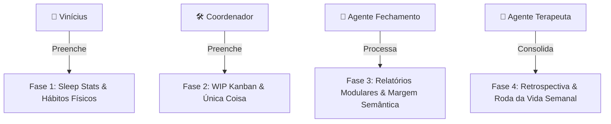

# ⚙️ Guia de Gestão de Rotinas, Empresas e Ciclos de Planejamento

Este manual serve como a **Bússola de Alinhamento Operacional** do Hórus System. Ele explica como as suas rotinas diárias, sua grade corporativa de empresas, e a estrutura do [[diario v2]] se integram de forma simbiótica com as ações dos seus agentes inteligentes.

---

## 📂 1. Governança das Configurações Locais (JSON)

Para manter o seu ecossistema 100% flexível e dinâmico, as configurações de hábitos e projetos não estão codificadas dentro dos scripts Python; elas ficam salvas de forma limpa em dois arquivos JSON centrais:

1. **[rotinas_config.json](../.system/config/rotinas_config.json)** — *O acesso é privado ao código apenas com Antigravity*:
   * **O que armazena:** Todos os itens detalhados das suas rotinas (`Acordar`, `Checkin`, `Arrumar a Casa` por cômodos, `Planejamento`, `Café em Família`, `Meio Dia`, `Início da Noite`, `Finalização`).
   * **Frequência de Atualização:** Sob demanda (quando você quiser adicionar um novo hábito ou ajustar tarefas domésticas).
2. **[empresas_config.json](../.system/config/empresas_config.json)** — *O acesso é privado ao código apenas com Antigravity*:
   * **O que armazena:** A árvore completa das suas empresas (`ViniciusPessoal`, `Futuro Corp`, `Devs de Negocio`, etc.), seus respectivos departamentos e a lista de projetos associados.
   * **Frequência de Atualização:** Sob demanda (quando um novo projeto ou empresa for criado).

---

## 🚀 2. Prompts de Comando Prontos para Edição Dinâmica

Sempre que desejar alterar suas rotinas ou adicionar novos projetos, **copie e cole estes prompts diretamente no chat do Antigravity** para que a IA realize o preenchimento estrutural perfeito sem erros de chaveamento JSON:

### 🧶 Prompt: Adicionar / Editar Hábito em `rotinas_config.json`
```plaintext
"Antigravity, ative o AGENTE_COORDENADOR.md. Preciso alterar o meu arquivo de hábitos diários.
- Ação: [Adicionar item X / Remover item Y / Criar nova rotina Z]
- Rotina afetada: [ex: Rotina Finalização da noite, Rotina arrumar a casa]

Por favor, faça a leitura de rotinas_config.json, valide a estrutura de chaves e arrays correspondente, insira o item de forma limpa e salve a alteração. Exiba a estrutura modificada para validação."
```

### 💼 Prompt: Cadastrar Nova Empresa ou Projeto em `empresas_config.json`
```plaintext
"Antigravity, ative o AGENTE_SUPREMO.md. Preciso cadastrar uma nova empresa ou projeto na minha grade.
- Empresa: [Nome da Empresa]
- Departamento: [Nome do Departamento]
- Novo Projeto: [Nome do Projeto]

Leia o arquivo empresas_config.json, insira os novos ramos respeitando a hierarquia de objetos JSON, valide a formatação de chaves, salve e mostre o resultado final."
```

---

## 📅 3. A Anatomia do Dia: Fases e Divisões de Responsabilidade

A engrenagem do seu dia a dia é centralizada no modelo [[diario v2]]. Cada fase de preenchimento e análise possui um dono específico:



### 👤 Fase 1: Preenchido pelo Usuário (Vinícius)
*   **O que preenche:**
    *   *Check-in do Sono:* Horário de dormir, acordar, nota do sono e peso ao acordar.
    *   *Descompressão Livre:* Áudios ou desabafos jogados no Telegram no fim da tarde.
    *   *Hábitos Físicos:* Checklists rápidos de hábitos executados.
*   **A Importância:** Liberta a memória de trabalho do TDAH no início do dia e permite a captura emocional sutil.

### 🛠️ Fase 2: Auditado e Preenchido pelo Coordenador (Coordenador Interno)
*   **Frequência:** De hora em hora e nas transições de blocos (08:00, 11:30, 14:00, 18:00).
*   **O que faz:**
    *   Verifica se o Kanban ultrapassou o limite rígido de **no máximo 3 cards** por curva (A, B e C).
    *   Force a seleção da **Única Coisa** do Bloco 1.
    *   Dispara o **Zoneamento do Dia** às 18h e 20h para forçar a desconexão e o início da Hora da Família.
*   **A Importância:** Garante a transição de personalidades (Hora de Produção vs. Hora de Presença Familiar), impedindo o acúmulo de tarefas e o limbo mental do WhatsApp.

### 🔄 Fase 3: Processado pelo Fechamento Diário (Agente de Fechamento)
*   **Frequência:** Diário, às 21:00h (ou sob demanda).
*   **O que faz:**
    *   Consolida as respostas no painel diário.
    *   Computa o **Fator de Confiabilidade Pessoal (0 a 10)**.
    *   Cria os 7 relatórios temáticos, isolando sentimentos familiares e de relacionamento em `Pessoal-YYYY-MM-DD.md` (longe de logs operacionais).
    *   Executa o **Ajuste de Margem Semântica** em `Base_Identidade_Vida.md` para notas 8.0 a 10.
*   **A Importância:** Limpa o ecossistema, preenche o histórico modular e garante que a mente inicie o dia seguinte sem resíduos ou "elásticos pendentes".

### 🧠 Fase 4: Análise e Auditoria Semanal (Gerente / Diretor / Terapeuta)
*   **Frequência:** Domingos à noite.
*   **O que faz:**
    *   Analisa o compilado de desabafos e dores biográficas.
    *   Aplica a **Roda da Vida Digital** pontuando de 0 a 10 os quatro eixos críticos negligenciados pelo modo de sobrevivência: *Saúde Mental (Inflexibilidade)*, *Casamento (Elo)*, *Paternidade (Laura)* e *Trabalho*.
    *   Gera as métricas de evolução e plota os vetores visuais no painel `Dash-hoje.canvas`.
*   **A Importância:** Permite a visão macro da trajetória. Mostra matematicamente onde a sua energia está vazando e recalibra os [[Protocolos_Comportamentais]] de forma algorítmica para a próxima semana.
