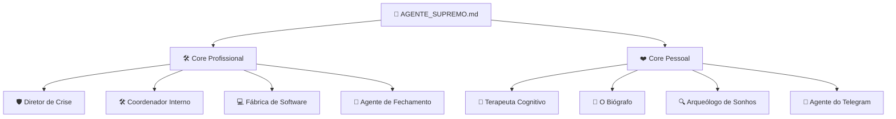

# 👑 Manual Supremo do Hórus System (Príncipe System)

Este é o **Guia Definitivo e Manual de Orquestração** do seu segundo cérebro. Ele mapeia toda a inteligência do seu ecossistema **100% local e nativo no Windows**, a matriz de agentes, a estrutura física do Obsidian Vault, e fornece um **diretório completo de prompts prontos para copiar e colar**.

---

## 📂 1. Mapeamento Completo de Pastas e Frequências

O ecossistema divide as pastas por propósitos funcionais para manter o cofre limpo, protegendo seus dados originais de forma intocável e estruturando relatórios modulares de forma automática.

| Diretório / Caminho Absoluto                                                                                                                                                       | O que armazena na prática?                                                                                                   | Frequência de Atualização    | Regra de Escrita / IA                                                            |
| :--------------------------------------------------------------------------------------------------------------------------------------------------------------------------------- | :--------------------------------------------------------------------------------------------------------------------------- | :--------------------------- | :------------------------------------------------------------------------------- |
| [hoje/](../hoje/)                                                                                                                                  | Logs brutos do Telegram e arquivos temporários de anotações do dia (`telegram-YYYY-MM-DD.md`, `pensamentos_organizados.md`). | Diária (Tempo Real).         | O Agente do Telegram escreve em modo silencioso (**save-only**).                 |
| [ArquivoProcessados/Diario/](../ArquivoProcessados/Diario/)                                                                                        | Histórico consolidado de fechamento de dias, semanas e meses (`Diario/Semana/`, `Diario/Mes/`).                              | Diário / Semanal (Domingos). | Gravado de forma modular pelo `AGENTE_FECHAMENTO.md`.                            |
| [[Base_Identidade_Vida]]                                                                                                                           | Princípios inalteráveis, visão de 10 anos, metas de 1 ano e Caverna Trimestral.                                              | Diária (Margem Incremental). | **Nunca sobrescrever**. O `AGENTE_FECHAMENTO` adiciona apenas insights ao final. |
| [[Protocolos_Comportamentais]]                                                                                                                     | Regras algorítmicas de contenção límbica (injustiça, autoimagem, feedback negativo e anti-paralisia).                        | Semanal / Sob demanda.       | O `AGENTE_TERAPEUTA` calibra e injeta regras de comportamento aqui.              |
| [ArquivoProcessados/Empresas/ViniciusPessoal/Sessoes_Terapeuticas/](../ArquivoProcessados/Empresas/ViniciusPessoal/Sessoes_Terapeuticas/)          | Logs semanais estruturados de sessões assíncronas de TCC (`sessao-terapia-YYYY-MM-DD.md`).                                   | Semanal (Sábados/Domingos).  | Criado e avaliado pelo Criteriómetro do `AGENTE_TERAPEUTA.md`.                   |
| [ArquivoProcessados/Empresas/ViniciusPessoal/Biografia/Notas_Originais/](../ArquivoProcessados/Empresas/ViniciusPessoal/Biografia/Notas_Originais/) | **Cofre Intocável:** Preservação 100% íntegra e original de notas longas brutas que você envia para o sistema.               | Sob demanda.                 | O `AGENTE_BIOGRAFO.md` copia os arquivos originais sem alterar uma única linha.  |
| [[Linha_do_Tempo_Vida]]                                                                                                                            | Linha do tempo biográfica existencial dividida em Infância, Carreira e Família.                                              | Sob demanda.                 | Preenchido e estruturado pelo `AGENTE_BIOGRAFO.md`.                              |

---

## 🤖 2. Matriz de Agentes, Personalidades e Ações

Toda a inteligência do sistema é modularizada em especificações de habilidades (`SKILLs/`). Cada agente tem um papel claro e está agrupado por sua esfera de atuação (Profissional vs. Pessoal):



### 🛠️ CORE PROFISSIONAL & OPERACIONAL

### 🛡️ 1. O Diretor de Operações de Crise (Skill `AGENTE_DIRETOR_CRISE.md`)
*   **Personalidade:** Focado em sobrevivência financeira rápida e blindagem corporativa.
*   **Ação Principal:** Aplica a "Guilhotina Corporativa" (esforço vs. retorno < 15 dias) e automatiza delegações.

### 🛠️ 2. Coordenador Interno (Skill `AGENTE_COORDENADOR.md`)
*   **Personalidade:** Empático, mas extremamente firme na gestão do TDAH do Vini.
*   **Ação Principal:** Aplica o Funil de Pareto Supremo, WIP estrito (max 3 cards por prioridade) e micro-sizing (PP a G). Dispara alertas horários e o protocolo "Zonear o Dia" (Trabalho vs. Família às 18:00 e 20:00).

### 💻 3. Fábrica de Software Unificada (Skill `AGENTE_DESENVOLVIMENTO.md`)
*   **Personalidade:** Engenheiro supremo de software, focado em código limpo e homologação local.
*   **Ação Principal:** Executa o pipeline de ponta a ponta (PO -> Tech Lead -> Dev -> QA).

### 🔄 4. Agente de Fechamento & Processamento Diário (Skill `AGENTE_FECHAMENTO.md`)
*   **Personalidade:** Organizado, analítico e consolidador.
*   **Ação Principal:** Processa logs diários, habits, executa monitoramento da Roda da Vida e realiza ajustes incrementais semânticos em `Base_Identidade_Vida.md`.

---

### ❤️ CORE PESSOAL, EMOCIONAL & FILOSÓFICO

### 🧠 5. O Terapeuta Cognitivo (Skill `AGENTE_TERAPEUTA.md`)
*   **Personalidade:** Acolhedor, focado em TCC, quebra de inibição emocional e simbiose cognitiva.
*   **Ação Principal:** Conduz sessões assíncronas no Telegram e aplica a **Regra do Bolo de Elásticos (Corte de Simbiose)** para trazer clareza rápida.

### 📜 6. O Biógrafo & Historiador de Identidade (Skill `AGENTE_BIOGRAFO.md`)
*   **Personalidade:** Focado em preservação de memórias e legado existencial.
*   **Ação Principal:** Copia relatos originais sem alteração para a pasta de preservação intocável, extrai a linha do tempo existencial e refina sua Missão, Visão e Valores.

### 🔍 7. O Arqueólogo de Sonhos (Skill `AGENTE_ARQUEOLOGO_SONHOS.md`)
*   **Personalidade:** Sutil, usando restrição criativa e contrastes de rotina ideal.
*   **Ação Principal:** Mapeia anseios de lazer, estilo de vida e sonhos profundos fora do trabalho para evitar rigidez mental.

### 🤖 8. Agente do Telegram (`telegram_agent.py`)
*   **Personalidade:** Silencioso, invisível e focado em captura.
*   **Ação Principal:** Transcreve áudios do Vini em logs diários estruturados em `hoje/telegram-YYYY-MM-DD.md`.

---

## 🚀 3. Guia Passo a Passo de Configuração & Prompt Directory

Para inicializar o sistema de forma limpa e objetiva, siga esta sequência exata. **Basta copiar e colar os prompts abaixo no chat com o seu assistente (Antigravity):**

### 📍 Passo 1: Extração e Mapeamento de Sonhos (Frequência: Quinzenal/Mensal)
> [!IMPORTANT]
> **Ação Recomendada:** Agende um bloco de 30 minutos no seu Google Calendar para essa conversa sem telas.
*   **Objetivo:** Capturar seus sonhos profundos de estilo de vida, lazer e família sem a pressão de metas lógicas.
*   **Prompt para Invocação:**
    ```plaintext
    "Antigravity, ative o AGENTE_ARQUEOLOGO_SONHOS.md. Conduza um diálogo investigativo comigo para extrair meus sonhos mais profundos, focando especialmente em estilo de vida, proteção familiar e lazer. Utilize técnicas de contraste de rotina ideal e não faça perguntas abertas genéricas que travem a minha mente."
    ```

### 📍 Passo 2: Estabelecendo as Metas de 10 Anos (Frequência: Trimestral)
*   **Objetivo:** Transformar os sonhos aprovados pelo Criteriómetro Límbico em metas palpáveis, alertando ativamente caso você tente inserir uma meta que não possua conexão límbica real com um sonho.
*   **Prompt para Invocação:**
    ```plaintext
    "Antigravity, com base no arquivo de sonhos consolidados, ative o AGENTE_COORDENADOR.md para estruturarmos minhas Metas de 10 Anos em Base_Identidade_Vida.md. Se eu tentar inserir alguma meta lógica ou reativa que não possua conexão direta com meus sonhos e estilo de vida ideal familiar, dê um alerta rígido de 'Inflexibilidade Cognitiva' e me ajude a recalibrar."
    ```

### 📍 Passo 3: O Planejamento Diário e "A Única Coisa" (Frequência: Todo Fim de Tarde)
*   **Objetivo:** Triar as pendências brutas no Criteriómetro e estabelecer **A Única Coisa** (Curva A) blindada para o Bloco 1 de amanhã.
*   **Prompt para Invocação:**
    ```plaintext
    "Antigravity, ative o AGENTE_COORDENADOR.md. Aqui está minha lista de pendências e brisas para amanhã: [COLE SUAS PENDÊNCIAS AQUI]. Aplique o Criteriómetro de Notas (Alinhamento de Ciclo, Blindagem Familiar, Clareza e Integridade) e force-me a definir A Única Coisa, limitando o WIP do meu Kanban a no máximo 3 cards por curva (A, B e C)."
    ```

### 📍 Passo 4: Processando Relatos Biográficos e Diários Brutos (Frequência: Sob demanda)
*   **Objetivo:** Enviar textos longos com memórias, relatos do passado ou anotações desconexas. O sistema arquiva a nota original sem alterar nada e preenche a linha do tempo.
*   **Prompt para Invocação:**
    ```plaintext
    "Antigravity, ative o AGENTE_BIOGRAFO.md para processar o meu relato bruto anexo ou texto abaixo. Lembre-se de primeiro copiar a íntegra original intacta na pasta Notas_Originais/ com a data de hoje, e depois ler semanticamente para estruturar e atualizar a minha Linha_do_Tempo_Vida.md, preenchendo as lacunas existenciais."
    ```

### 📍 Passo 5: Sessão de Descompressão Terapêutica (Frequência: Todo Fim de Semana)
*   **Objetivo:** Responder de forma assíncrona ao Telegram para descarregar o estresse de exaustão, injustiça e recalibrar os protocolos em tempo de execução.
*   **Prompt para Invocação (Se quiser fazer diretamente no chat):**
    ```plaintext
    "Antigravity, ative o AGENTE_TERAPEUTA.md. Busque os relatórios semanais de Pessoal e Trabalho, identifique onde a minha energia vazou (estresse de injustiça, WhatsApp ou culpa familiar) e me faça a primeira rodada de até 3 perguntas de contraste ultra-direcionadas para fecharmos o ciclo."
    ```

---

## 🔄 4. O Fluxo de Rotinas Sistêmicas e Telegram

### 🤖 Rotinas Automáticas (Windows Backend em Segundo Plano)
*   **Processamento Diário (21:00h):** O `AGENTE_FECHAMENTO` varre o log `hoje/telegram-YYYY-MM-DD.md`, preenche os hábitos e gera os 7 relatórios modulares diários.
*   **Exportação Semanal de Dores (Sexta, 22:00h):** O sistema condensa o diário de `Pessoal` e `Trabalho` da semana e gera o payload que servirá de input primário para o Terapeuta.
*   **Disparo do Gatilho Terapêutico (Sábado, 09:00h):** O `telegram_agent.py` lê o payload de dores semanais, monta as perguntas socráticas e as envia para o chat do Vini no Telegram.
*   **Consolidação Semanal (Domingo, 20:00h):** O sistema coleta a sessão respondida, plota as notas de Saúde Mental, Casamento (Elo), Filha (Laura) e Trabalho no vetor do `Dash-hoje.canvas`.

### 👥 Rotinas Humanas de Interface
*   **O Check-in do Protetor (Domingos à Noite):** Responder ao bot rápida e francamente sobre o casamento e filha.
*   **Zonear o Dia (Diário - 18:00h e 20:00h):** Fechar canais de trabalho ao receber o comando sistêmico *"Transição Familiar: Laura e Elo precisam de você presente"*.
