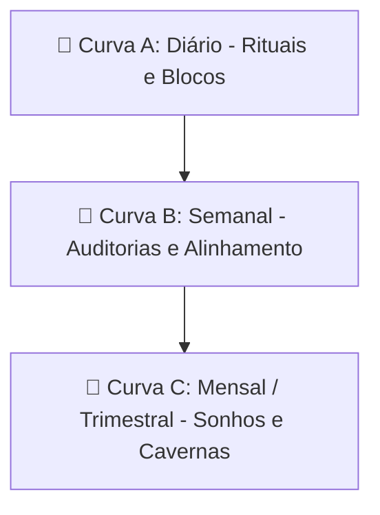

# ⏳ Manutenção de Rotinas & Ciclos de Vida (Método A-B-C)

Este manual estabelece a grade de manutenção cronológica do seu ecossistema, dividida em **Curvas A, B e C** de frequência. Para evitar o esgotamento mental e a paralisia do TDAH, as tarefas de longo prazo são distribuídas estrategicamente para tornar as semanas e os meses extremamente leves.

---

## 🏛️ Estrutura Geral de Manutenção (Curvas A, B e C)



---

## 📅 CURVA A: Manutenção Diária (O Ritmo do Dia)

O seu dia é governado por gatilhos fixos no Telegram e no Obsidian, desenhados para zonear o tempo de forma estrita e blindar o hiperfoco.

### ⏱️ Grade Cronológica e Prompts do Turno

#### 🌅 04:30 – Ritual do Acordar (Físico e Consciência)
*   **O que fazer:** Me pesar, tomar remédio, ler a base de identidade (Quem sou eu e diretriz de ciclo).
*   **Prompt para Invocação (Coordenador):**
    ```plaintext
    "Antigravity, ative o AGENTE_COORDENADOR.md. Aqui estão minhas estatísticas de sono de hoje: Dormi às [X]h, acordei às 04:30h, nota do sono [Y], peso [Z]kg. registre o meu check-in diário no log do Obsidian e gere a minha Única Coisa da Curva A para o Bloco 1 de trabalho."
    ```

#### 💼 08:00 – Início do Bloco de Trabalho (WIP e Limpeza de Foco)
*   **O que fazer:** Limpeza total do WhatsApp/emails e bloqueio de abas extras.
*   **Prompt para Invocação (Coordenador):**
    ```plaintext
    "Antigravity, ative o AGENTE_COORDENADOR.md. Realizei a faxina do e-mail e do WhatsApp. Confirme a única tarefa Curva A em execução no meu Kanban ativo e ative a micro-cobrança horária no Telegram."
    ```

#### 🧭 10:00 – Relatório de Produtividade do Bloco 1 (Progresso Factual)
*   **O que fazer:** Descarregar o status da entrega principal antes de se dispersar em suporte ou reatividade.
*   **Prompt para Invocação (Coordenador):**
    ```plaintext
    "Antigravity, ative o AGENTE_COORDENADOR.md. Aqui está o relatório factual do que fiz no Bloco 1: [DIGITE O QUE ENTREGOU]. Calcule se houve dispersão ou tarefas voadoras e me dê o próximo micro-passo PP de 15 minutos para manter a tração."
    ```

#### 🍽️ 12:00 – Parada e Rotina do Meio Dia (Desconexão Operacional)
*   **O que fazer:** Limpar a mesa do escritório, comer e levar a Laura para a escola.
*   **Prompt para Invocação (Coordenador):**
    ```plaintext
    "Antigravity, ative o AGENTE_COORDENADOR.md. Estou parando para o almoço e transição familiar. Registre o encerramento do Bloco 1 e dê o comando de zoneamento familiar para o meio dia."
    ```

#### 🏋️ 18:00 – Transição Familiar Noturna (Zonear o Dia)
*   **O que fazer:** Fechar computador, recolher garrafas, trocar de roupa e buscar a Laura na escola para ir à academia.
*   **Prompt para Invocação (Supremo):**
    ```plaintext
    "Antigravity, ative o AGENTE_SUPREMO.md. Estou encerrando o expediente. Rode o Protocolo de Blindagem Familiar: desligue a minha mente corporativa, prepare o meu desabafo livre pessoal de hoje e me lembre de guardar o celular para estar 100% presente com a Laura e a Elo."
    ```

#### 🌙 21:00 – Ritual de Finalização (Descompressão e Fechamento)
*   **O que fazer:** Relatório do dia, separar roupa para amanhã, tomar remédio e dormir.
*   **Prompt para Invocação (Fechamento):**
    ```plaintext
    "Antigravity, ative o AGENTE_FECHAMENTO.md. Vamos processar minhas notas de hoje em hoje/telegram-YYYY-MM-DD.md. Aqui estão os dados adicionais do meu dia: Nota do dia [X], O que fiz de bom [Y], Conquistas [Z], Gratidão [W]. Processe, gere os relatórios modulares diários e exporte o compilado das minhas dores pessoais para o arquivo Pessoal-YYYY-MM-DD.md."
    ```

---

## 📅 CURVA B: Manutenção Semanal (Auditoria e Alinhamentos)

A semana é organizada no **Fim de Semana (Sábado/Domingo)** para evitar o peso cognitivo acumulado no horário comercial.

### 🗓️ Agenda Semanal Recomendada

#### 🧠 Sábado de Manhã (09:00) – Descompressão Terapêutica (Terapeuta)
*   **Objetivo:** Conversar assincronamente com o Terapeuta para "desembaraçar o bolo de elásticos" e recalibrar os protocolos comportamentais.
*   **Prompt para Invocação:**
    ```plaintext
    "Antigravity, ative o AGENTE_TERAPEUTA.md. Leia minhas notas semanais de exaustão e dores. Aplique a Regra de Ouro do Bolo de Elásticos (Corte de Simbiose) para trazer uma clareza rápida para minha vida, gerando as novas diretrizes em Protocolos_Comportamentais.md."
    ```

#### 📜 Sábado à Tarde (14:00) – Atualização Biográfica (Biógrafo)
*   **Objetivo:** Jogar os relatos ou memórias longas brutas da semana no sistema.
*   **Prompt para Invocação:**
    ```plaintext
    "Antigravity, ative o AGENTE_BIOGRAFO.md. Aqui está minha nota longa de reflexão semanal: [COLE O RELATO]. Salve o original sem alterações na pasta de Notas_Originais/ e atualize a minha Linha_do_Tempo_Vida.md."
    ```

#### 🧭 Domingo de Manhã (10:00) – Planejamento Estratégico & Finanças (Coordenador)
*   **Objetivo:** Revisar as metas de 1 semana, auditar a lista de compras em `Gestao_Compras.md` com o Diretor de Crise e liberar pagamentos da semana.
*   **Prompt para Invocação:**
    ```plaintext
    "Antigravity, ative o AGENTE_COORDENADOR.md. Vamos rodar o Planejamento Semanal. Audite minha lista em Gestao_Compras.md com o Diretor de Crise e monte minhas metas de Curva A, B e C para a próxima semana."
    ```

#### 📊 Domingo à Noite (20:00) – Roda da Vida (Telegram/Obsidian)
*   **Objetivo:** Computar o score das esferas (Saúde Mental, Casamento, Filha, Trabalho) e plotar os vetores no `Dash-hoje.canvas`.

---

## 📅 CURVA C: Manutenção Mensal & Trimestral (Sonhos e Cavernas)

O planejamento de longo prazo ocorre no **primeiro e no último dia de cada mês**.

### 🗓️ Rotinas Mensais e Trimestrais

#### 💭 1º Dia do Mês – Auditoria de Sonhos e Compras
*   **Objetivo:** Revisar e maturar ideias na quarentena de 14 dias de pequenos cursos e planejar compras pendentes no `Gestao_Compras.md`.
*   **Prompt para Invocação:**
    ```plaintext
    "Antigravity, ative o AGENTE_ARQUEOLOGO_SONHOS.md. Vamos auditar a minha base de sonhos e os itens retidos em Gestao_Compras.md. Me ajude a limpar o que foi impulsivo e priorizar o que é genuíno para este novo ciclo."
    ```

#### 🛡️ Fim do Trimestre – A Caverna Trimestral (90 Dias)
*   **Objetivo:** Planejar a Caverna de 90 dias focando em tração (Trincheira/Projeto DNA).
*   **Prompt para Invocação:**
    ```plaintext
    "Antigravity, ative o AGENTE_COORDENADOR.md. Chegamos ao fechamento do trimestre. Vamos revisar a Caverna Trimestral anterior e montar o foco de 90 dias focado no Projeto DNA, garantindo o limite estrito de metas para evitar afogamento mental."
    ```

---

## ⚖️ A Regra de Distribuição Balanceada (Aliviando o Peso)

Para impedir o estresse cognitivo, o Hórus System aplica a seguinte regra de **Descompressão Balanceada**:
1.  **Do Diário para o Semanal:** Se uma tarefa diária (como revisão de metas do mês) demorar mais de 5 minutos, ela é **bloqueada** e enviada para o Planejamento Semanal de Domingo de Manhã.
2.  **Do Semanal para o Mensal:** Análises detalhadas de performance comercial ou de currículos no LinkedIn são executadas exclusivamente na auditoria de 1º dia do mês.
3.  **Corte Automático de Brisas:** Qualquer ideia voadora diária é enviada para o `💭 Sonhos.md` sem análise imediata, sendo auditada apenas na rotina mensal de sonhos do Arqueólogo.
